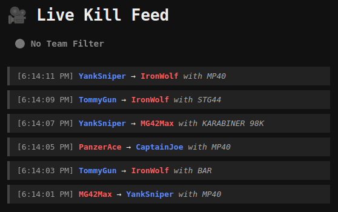

# Kill Feed Stream Overlay

This is a lightweight Node.js web application that displays a live kill feed for **Hell Let Loose** by subscribing to CRCON WebSocket log stream events. The frontend displays filtered "KILL" logs in real-time, designed to be used as a kill feed overlay for game streaming.



---

## Features

- Live kill feed via WebSocket
- Styled frontend overlay for streamers
- Team-based color highlights (Axis red / Allies blue)
- Fade-out animation for old entries
- Team filter label display
- Mock CRCON log server for testing
- Command-line filters for team or specific player tracking

---

## Prerequisites

- Node.js >= 18.x
- A running CRCON WebSocket log stream server (or use the included mock)
- `.env` file with the following variables:

```bash
CRCON_WS_URL=ws://your-crcon-instance:8010/ws/logs
CRCON_API_TOKEN=your_crcon_api_token
PORT=3000
```

`PORT` is optional, defaults to 3000.

---

## Installation

```bash
git clone https://github.com/Sbosvk/crcon_kill_feed.git
cd crcon_kill_feed
npm install
```

---

## Usage

### Launch with Live Logstream

```bash
npm run app
```

### Launch with Team or Player Filter

```bash
npm run app -- --allies           # Only show kills involving Allies
npm run app -- --axis             # Only show kills involving Axis
npm run app -- --id <steam_id>    # Only show kills involving specific Steam ID
npm run app -- --axis --id 7656... # Combine filters
```

### Launch the Mock Server (for development/styling)

```bash
node mock_crcon_ws_server.js
```

This will simulate random kills between players from Axis and Allies.

---

## Web UI

Once running, open:

```
http://localhost:3000
```

You will see the live kill feed:

- Entries fade out after 10 seconds
- Axis players are colored red
- Allies players are colored blue
- Weapon name and time are included
- If a team filter is applied, a label shows above the feed

---

## License

MIT

---

## Credits

Made with ❤️ for Hell Let Loose streamers by Oliver Krilov.

